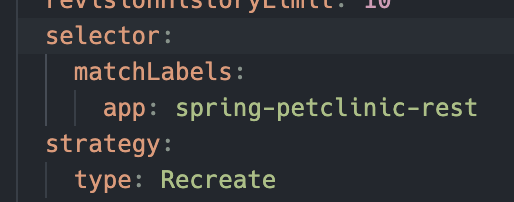
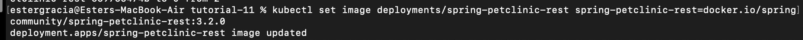

# Adpro Tutorial 11: Deployment on Kubernetes 
Ester Gracia/2206041991/Adpro C

## 1. Hello Minicube 
1. After the app was exposed as a service, there appear some GET / in the logs. Everytime I open the app the GET / logs increased. Seems like it's recording everytime a get request is sent to the app. 
2. The -n flag is used to specify the namespace. A namespace isolates groups of resources in a cluster. With "-n kube-system" we want to access the resources in the kube-system namespace. That's why our newly created pods/services are not listed, as they're not part of kube-system. 

## 2. Rolling Update & Kubernetes Manifest File 
1. In recrete deployment, all existing Pods are killed before new ones are created. In rolling update, some old Pods are killed and new ones are created. This is done to ensure that the application is still running while the update is being done. We can specify the minimum number of available Pods during the entire update process. Simply put, the recreate deployment is like the big bang update explained in the class, while rolling update is just the same as what was explained in the class.
2. 
   
4. The benefit of using a Kubernetes manifest file is that it allows us to define the desired state of the application. This way, we can easily deploy the application to any Kubernetes cluster without having to manually configure the cluster. It also allows us to version control the configuration of the application, making it easier to track changes and roll back to previous versions if needed. Without a manifest file, we would have to manually configure the application on each cluster, which is time-consuming and error-prone. Like when doing the previous tutorial, I did a lot of re-typing because of typos. 